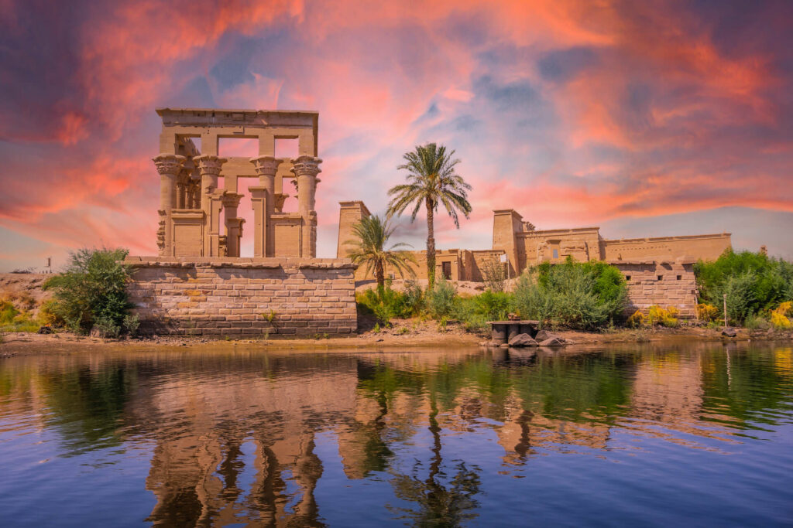
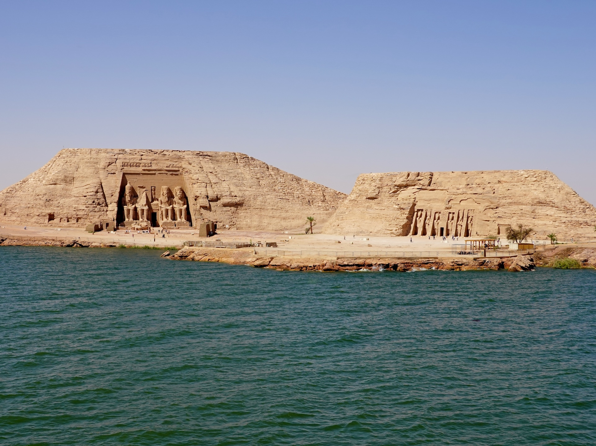
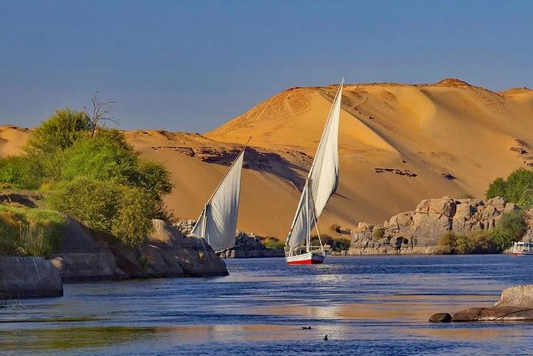
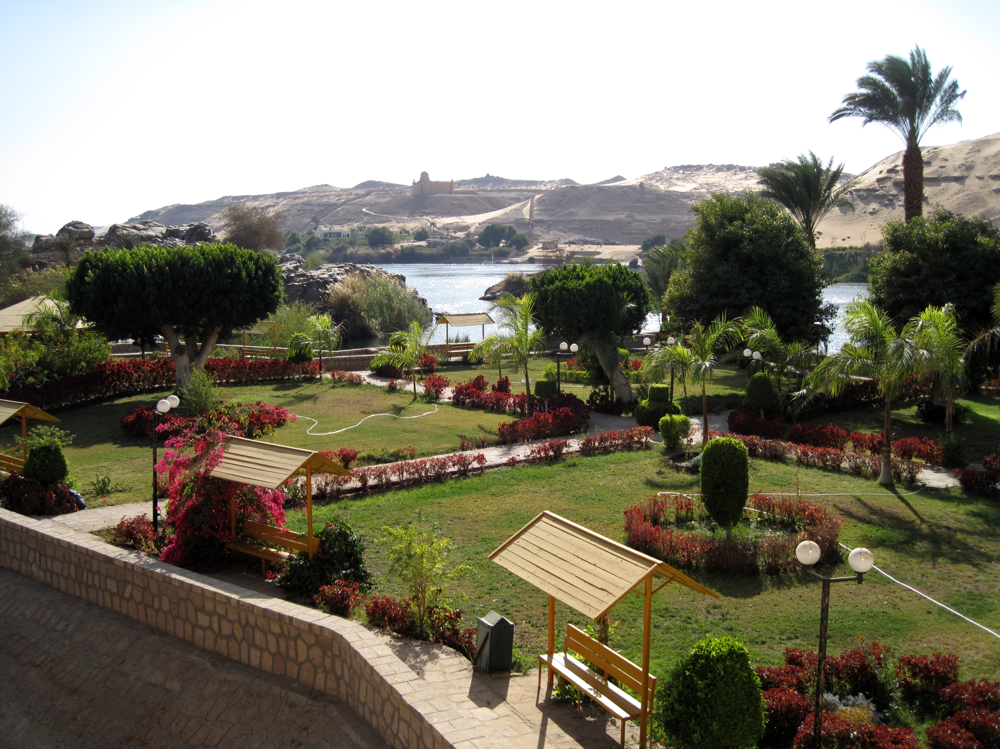
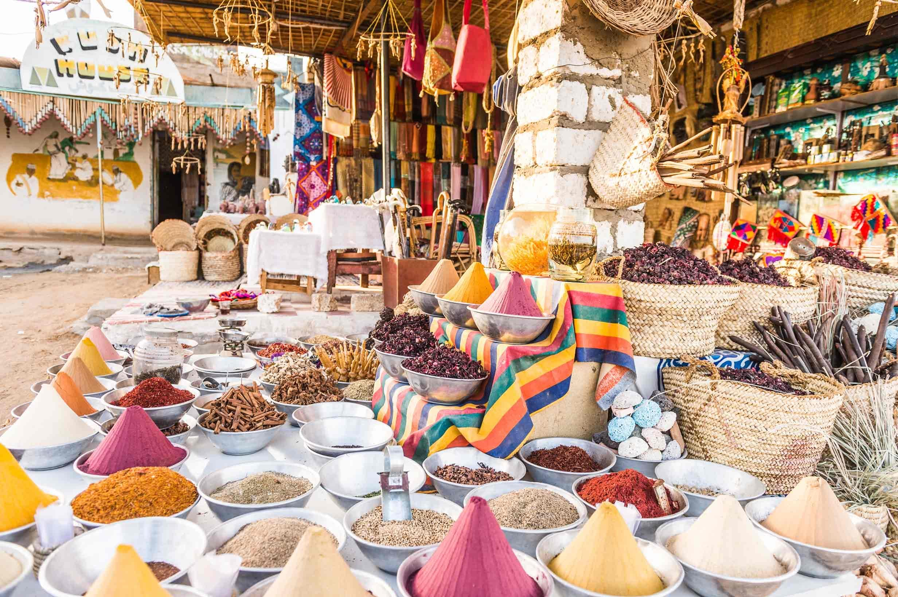
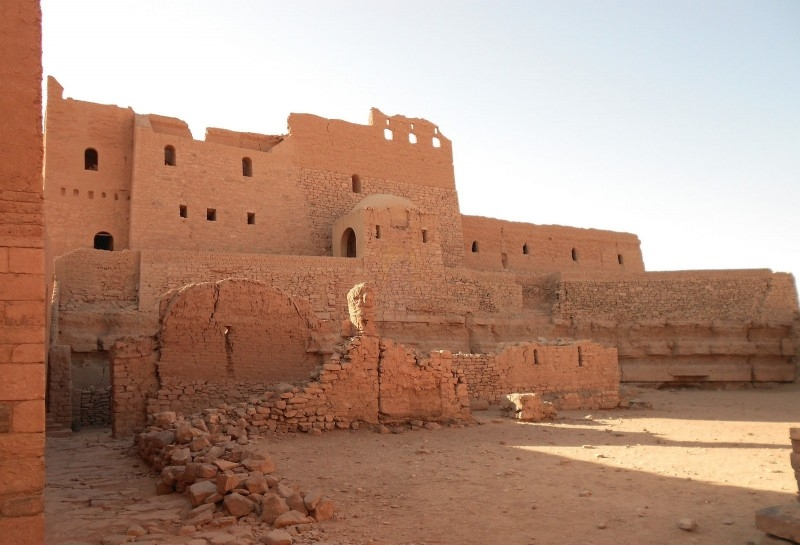
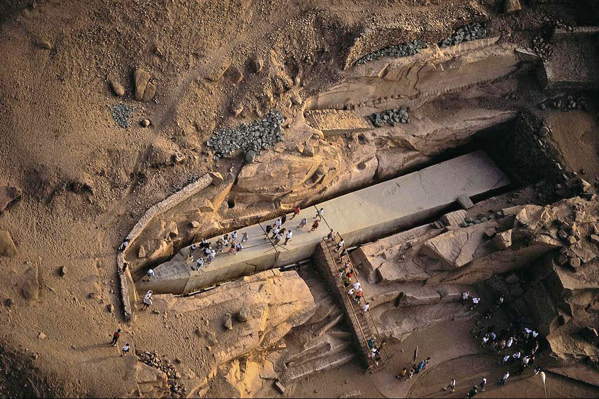
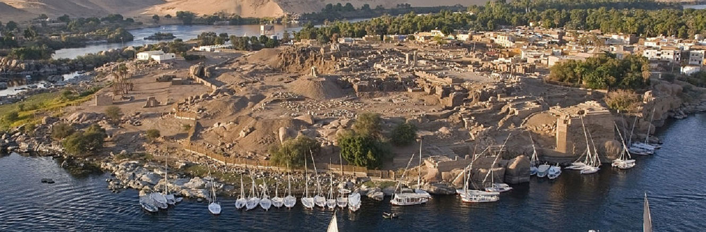

Aswan ist ein echtes kulturelles Juwel mit vielen beeindruckenden Sehenswürdigkeiten. Hier sind absolute Highlights, die du nicht verpassen solltest:

### Tempel von Philae

Der Tempel von Philae ist wohl das bekannteste Highlight in Aswan und gehört zu den wichtigsten antiken Stätten Ägyptens. Der Tempel war der Göttin Isis gewidmet und befindet sich auf einer Insel im Nil. Besonders beeindruckend ist die Lage des Tempels, der auf einer Insel im See von Nasser liegt – eine wahre Ikone der ägyptischen Architektur.

### Abu Simbel

Abu Simbel ist ein weiteres absolut beeindruckendes UNESCO-Weltkulturerbe, das nur eine kurze Fahrt von Aswan entfernt ist. Der Tempel, der von Ramses II. erbaut wurde, ist berühmt für seine monumentalen Statuen und die faszinierende Geschichte seiner Rettung vor den Fluten des Nasser-Staudamms.

### Der Nil und die Felukenfahrten

Eine Bootsfahrt auf dem Nil in Aswan ist ein einmaliges Erlebnis. Du kannst eine traditionelle Feluke (ein Segelboot) nehmen und die friedliche Atmosphäre des Nils genießen, während du an den malerischen Ufern vorbeifährst. Dies gibt dir die Möglichkeit, die Landschaft und historische Stätten aus einer völlig neuen Perspektive zu sehen.

### Der Botanische Garten von Aswan

Der Botanische Garten von Aswan ist eine grüne Oase auf einer Insel im Nil und beherbergt eine Vielzahl tropischer und subtropischer Pflanzen. Der Garten bietet nicht nur eine ruhige Flucht aus der Hitze, sondern auch fantastische Aussichten auf die Umgebung und den Nil.

### Der Nubische Markt

Der Nubische Markt in Aswan ist ein lebendiger Ort, um in die Kultur der Region einzutauchen. Hier kannst du lokale Kunsthandwerke, Gewürze und Souvenirs kaufen und die bunte Atmosphäre genießen. Der Markt ist auch ein großartiger Ort, um mit den freundlichen Einheimischen in Kontakt zu kommen.

### Das Simeonskloster (Monastery of St. Simeon)

Das Simeonskloster liegt auf einem Hügel östlich des Nils und bietet nicht nur einen historischen Einblick in das religiöse Leben des frühen Christentums, sondern auch eine herrliche Aussicht auf Aswan und den Nil. Es wurde im 6. Jahrhundert gegründet und war ein bedeutendes Zentrum des christlichen Glaubens in der Region. Heute sind nur noch Ruinen übrig, aber die Anlage ist dennoch beeindruckend und zeugt von der religiösen Geschichte der Gegend.

### Der Unvollendete Obelisk (Unfinished Obelisk)

Der unvollendete Obelisk befindet sich in einem Steinbruch in Aswan und ist der größte Obelisk, der je in Ägypten erbaut werden sollte. Leider wurde der Obelisk während der Fertigstellung beschädigt, aber er gibt einen faszinierenden Einblick in die Technik der Alten Ägypter. Der Obelisk misst über 40 Meter und ist ein beeindruckendes Beispiel für die Arbeitsweise der alten Steinmetze.

### Die Elephantine Insel

Die Elephantine Insel ist eine grüne Oase im Nil, bekannt für ihre historische Bedeutung und ihre malerische Schönheit. Auf der Insel befinden sich Überreste eines alten ägyptischen Tempels und ein Museum, das interessante Artefakte aus der Region zeigt. Die Insel war früher ein wichtiger Handelsposten und eine militärische Bastion. Heute ist sie ein wunderbarer Ort für Spaziergänge und bietet wunderschöne Ausblicke auf den Nil und die Umgebung.

Diese Highlights bieten dir eine perfekte Mischung aus Geschichte, Kultur und Natur, die Aswan zu einem unvergesslichen Reiseziel machen.

