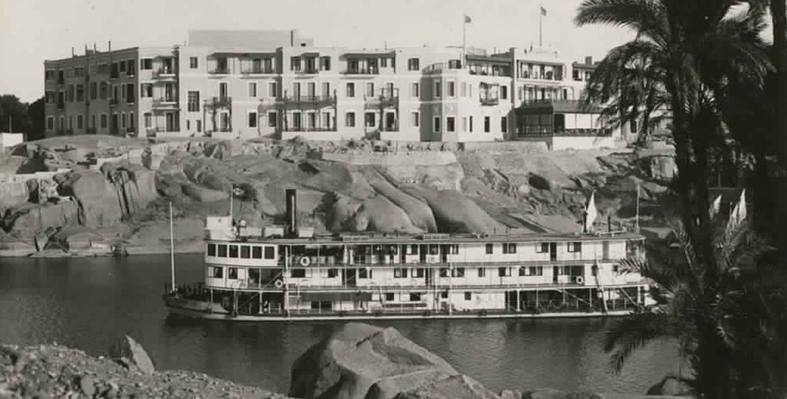
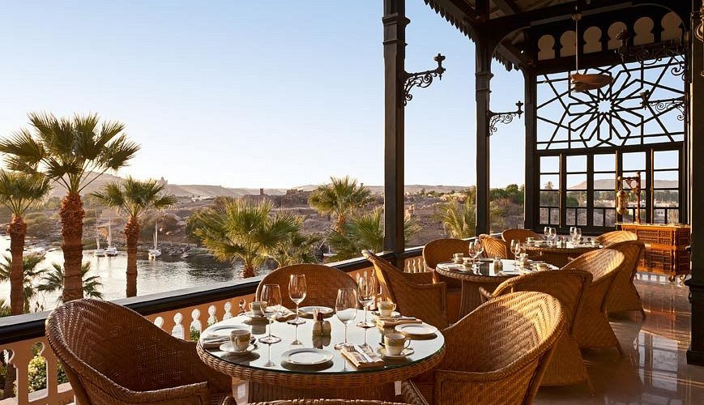
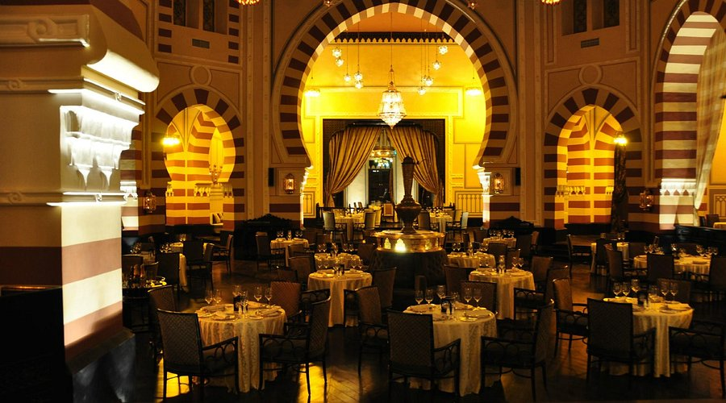
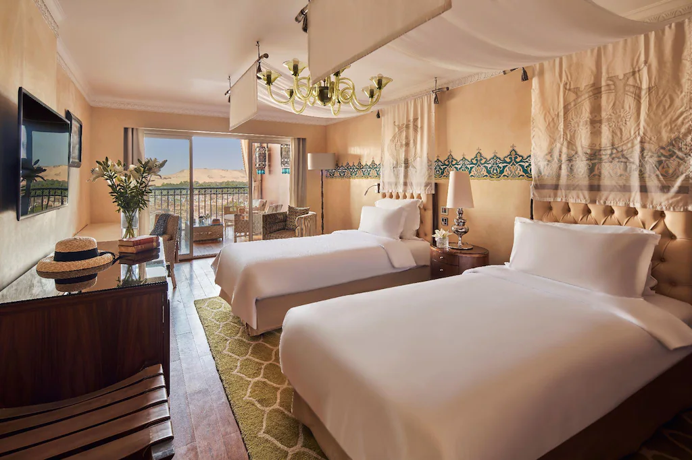

Das [Sofitel Legend Old Cataract Aswan](https://all.accor.com/hotel/1666/index.en.shtml) ist weit mehr als nur ein Luxushotel; es ist eine lebende Legende und ein Wahrzeichen Ägyptens. Gelegen in der faszinierenden Stadt Assuan, bietet dieses Hotel eine unvergleichliche Mischung aus historischem Charme, modernem Luxus und einer Lage, die ihresgleichen sucht.

### Ein Ort mit reicher Geschichte und einzigartiger Atmosphäre

Seit seiner Eröffnung im Jahr 1899 hat das Old Cataract Geschichte geschrieben. Erbaut im eleganten viktorianischen Stil, thront es majestätisch auf einem Granitfelsen über dem Nil, an der Schwelle zur Nubischen Wüste. Über die Jahrzehnte hinweg war es ein bevorzugter Aufenthaltsort für gekrönte Häupter, Staatsmänner und berühmte Persönlichkeiten. Agatha Christie fand hier Inspiration für ihren weltbekannten Roman "Tod auf dem Nil", und Winston Churchill zählte ebenfalls zu den illustren Gästen. Diese glanzvolle Vergangenheit verleiht dem Hotel eine einzigartige Aura und eine Atmosphäre zeitloser Eleganz, die Gäste vom ersten Moment an in ihren Bann zieht.

### Spektakuläre Lage mit atemberaubendem Nilblick

Die Lage des Hotels ist schlichtweg privilegiert. Direkt am Ufer des Nils bietet es von vielen Zimmern, Suiten und öffentlichen Bereichen aus einen atemberaubenden Panoramablick auf den Fluss, die Insel Elephantine mit ihren antiken Ruinen und die sanften Dünen der Wüste am gegenüberliegenden Ufer. Die Sonnenuntergänge über dem Nil, beobachtet von der berühmten Terrasse des Hotels, sind ein unvergessliches Schauspiel. Die ruhige und zugleich zentrale Lage ermöglicht es, die Schönheit Assuans zu geniessen und gleichzeitig einen idealen Ausgangspunkt für Erkundungen zu haben. Das sanfte Gleiten der traditionellen Feluken auf dem Wasser trägt zur malerischen Szenerie bei.

### Exquisite Kulinarik in besonderem Ambiente

Gastronomische Erlebnisse werden im Old Cataract grossgeschrieben. Das Hotel verfügt über mehrere hochklassige Restaurants, die unterschiedliche kulinarische Genüsse in einem jeweils einzigartigen Ambiente bieten:

- 1902 Restaurant: Berühmt für seine beeindruckende arabische Kuppel und die exquisite französische Küche, bietet dieses Restaurant ein Dinner-Erlebnis der Extraklasse.
- The Terrace: Hier geniessen Gäste internationale und orientalische Gerichte bei einem unvergleichlichen Blick über den Nil – ideal für jede Tageszeit.
- Oriental Kebabgy: Spezialisiert auf authentische orientalische und ägyptische Köstlichkeiten, ebenfalls mit fantastischer Aussicht.
- Saraya: Ein elegantes Restaurant mit mediterranem Fokus in entspannter Atmosphäre.

Die Verwendung frischer, hochwertiger Zutaten und die meisterhafte Zubereitung garantieren kulinarische Höhepunkte während des gesamten Aufenthalts.

### Luxuriöser Komfort und erstklassiger Service

Das Sofitel Legend Old Cataract verbindet gekonnt historischen Prunk mit modernstem Komfort. Die Zimmer und Suiten sind stilvoll und luxuriös eingerichtet, viele davon bieten private Balkone mit dem berühmten Nilblick. Gäste erwartet ein Höchstmass an Komfort und ein Service, der für seine Aufmerksamkeit und Diskretion bekannt ist. Der legendäre Poolbereich, der sich malerisch in die Granitfelsen einbettet, lädt zur Entspannung ein. Das hoteleigene So SPA bietet zudem eine Oase der Ruhe und Regeneration mit einer Auswahl an wohltuenden Behandlungen.

### Ein unvergessliches Reiseziel

Ein Aufenthalt im Sofitel Legend Old Cataract Aswan ist mehr als nur eine Übernachtung – es ist eine Reise in eine andere Welt. Die Kombination aus faszinierender Geschichte, atemberaubender Naturkulisse, exquisiter Kulinarik und luxuriösem Komfort macht es zu einem idealen Ort für anspruchsvolle Reisende und für besondere Anlässe, die einen unvergesslichen Rahmen verdienen. Es ist ein Ort, der bleibende Eindrücke hinterlässt und die Magie Ägyptens auf einzigartige Weise erlebbar macht.
